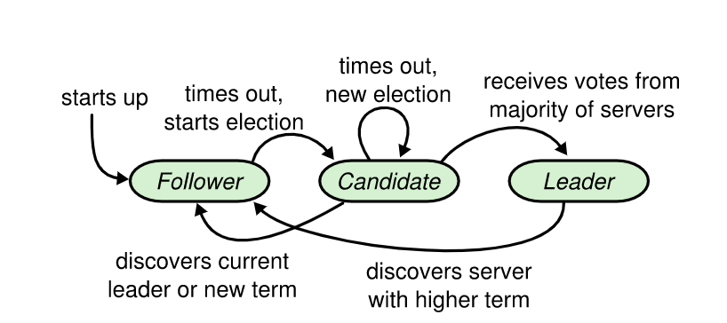
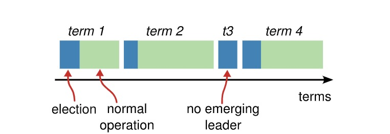
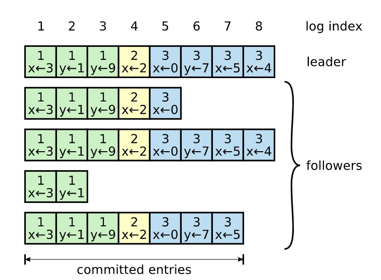
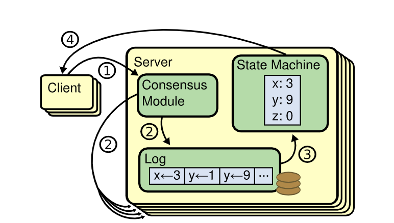

### 一、Raft协议简介

* Raft is a consensus algorithm for managing a replicated log（Raft 是一种为了管理复制日志的一致性算法）

* 复制状态机概念，复制状态机是指每个状态机或系统如果初始状态一致，然后接受的改变状态的命令也一致，最后产生的结果状态也是相同。

* 中英文论文地址：https://github.com/maemual/raft-zh_cn

### 二、Raft选举过程

* 选举过程图1（整体视角）

* 选举过程图2（leader视角）

### 三、Raft日志复制流程

* 日志格式：term + index + data + type

* 请求处理整体流程

* 请求处理详细流程

### 四、Raft协议动画演示

* Raft系统运行可视化1 [http://thesecretlivesofdata.com/raft](http://thesecretlivesofdata.com/raft/)

* Raft系统运行可视化2 [https://raft.github.io/#implementations](https://raft.github.io/#implementations)

### 五、hashicorp/raft源码讲解

* hashicorp/raft库 [https://github.com/hashicorp/raft](https://github.com/hashicorp/raft)

* raft节点配置相关

* raft启动流程

* raft监听事件

### 六、运行hashicorp/raft库搭建的简单kv服务

* 编译：go build -mod vendor

* 启动node1: ./raft-demo --http_addr=127.0.0.1:7001 --raft_addr=127.0.0.1:7000 --raft_id=1 --raft_cluster=1/127.0.0.1:7000,2/127.0.0.1:8000,3/127.0.0.1:9000

* 启动node2: ./raft-demo --http_addr=127.0.0.1:8001 --raft_addr=127.0.0.1:8000 --raft_id=2 --raft_cluster=1/127.0.0.1:7000,2/127.0.0.1:8000,3/127.0.0.1:9000

* 启动node3: ./raft-demo --http_addr=127.0.0.1:9001 --raft_addr=127.0.0.1:9000 --raft_id=3 --raft_cluster=1/127.0.0.1:7000,2/127.0.0.1:8000,3/127.0.0.1:9000

* set请求：curl http://127.0.0.1:7001/set?key=test_key&value=test_value

* get请求：curl http://127.0.0.1:7001/get?key=test_key

### 七、模拟场景

##### 选举变化相关

1. 集群启动后，follower等待一个随机election timeout时间变成candidate，然后发起投票，如果不能获得majority票数，则任期term会一直增加（未pre-vote情况）(branch: election-1)

2. 集群启动后，follower等待一个随机election timeout时间变成candidate，然后发起投票，获得majority票数的节点变成leader (branch: election-2)

3. leader选举成功后发送heartbeat保持leader的地位(branch: election-3)

4. leader失去majority节点的heartbeat响应，退回到follower(branch: election-4)

5. leader发现更高的term退回到follower(branch: election-5)

##### 日志复制相关

1. leader接收客户端请求，向集群内所有节点发送复制RPC，所有都正常响应 -> 正常commit，然后apply到状态机，最后返回客户端处理成功(branch: replicate-log-1)

2. leader接收客户端请求，向集群内所有节点发送复制RPC，majority正常响应 -> 正常commit，然后apply到状态机，最后返回客户端处理成功(branch: replicate-log-2)

3. leader接收客户端请求，向集群内所有节点发送复制RPC，少于majority正常响应 -> 不能commit(branch: replicate-log-3)

### 八、收获

* hashicorp/raft源码

* raft选举与日志复制

### 九、QA
